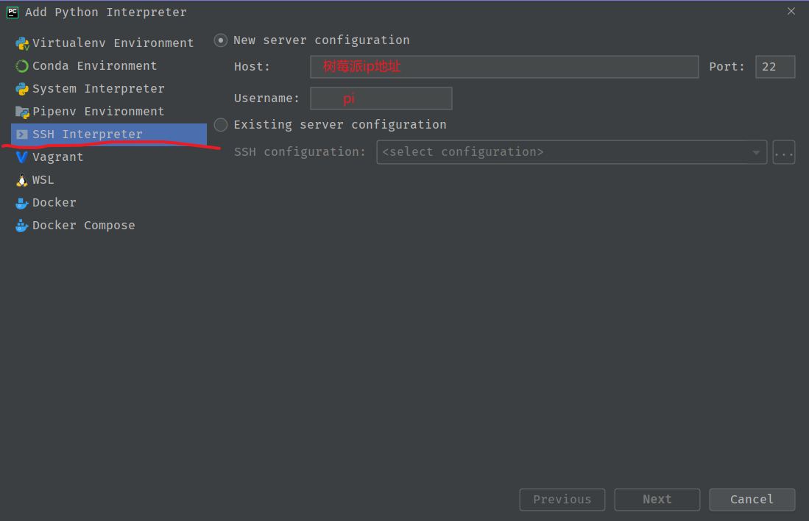

# PyCharm 开发环境搭建

请现在树莓派上安装好程序的依赖

```
sudo apt update
sudo apt install python3-pyqt5.qtwebkit python3-pyqt5
sudo pip3 install EasySettings[all]
```

然后打开 PyCharm, 在 PyCharm 中打开 piculator-client-software

添加interpreter





输入树莓派的密码


然后便可以远程调试树莓派

创建调试设置文件


注意工作目录是src目录， 不是app目录

